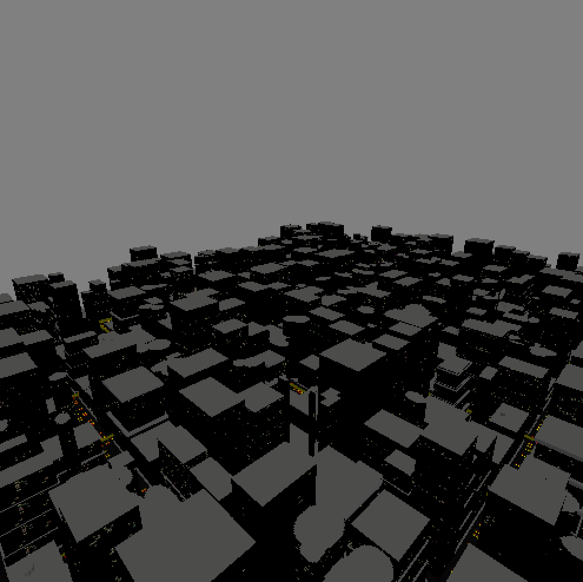
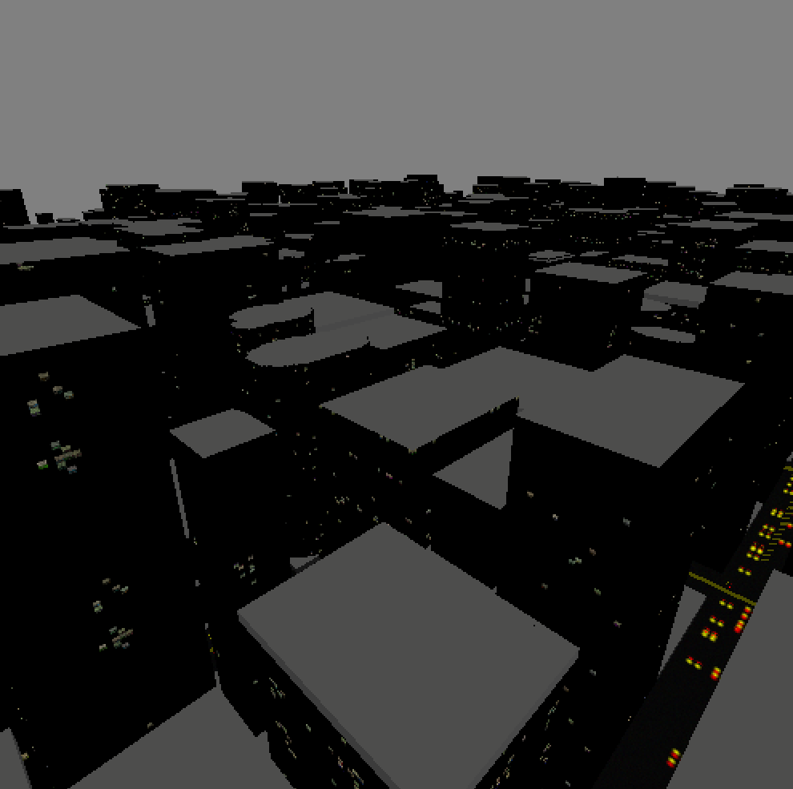

# ProcGenCity
This project is a procedurally generated City made in OpenGL, which was my final Graphics Project during my Graphics course at Baylor University.

Algebra.h was supplied by the professor.

Will need to have OpenGL installed and working on your machine to use this.

## Contribution:
* Created the random textures of the procedurally generated city

## Purpose:
* To create a procedurally generated city using OpenGL and C++
* To further my knowledge of C++ and OpenGL
* To learn how to create random textures using OpenGL
* Final project for the Graphics Course at Baylor University

## Lessons Learned:
* Implemented randomly generated textures in OpenGL and C++
* Furthered my knowledge of OpenGL and C++

## Other Contributors:
Worked on this with Tyler Hartwig (https://github.com/tylerhartwig)

## Screenshots

